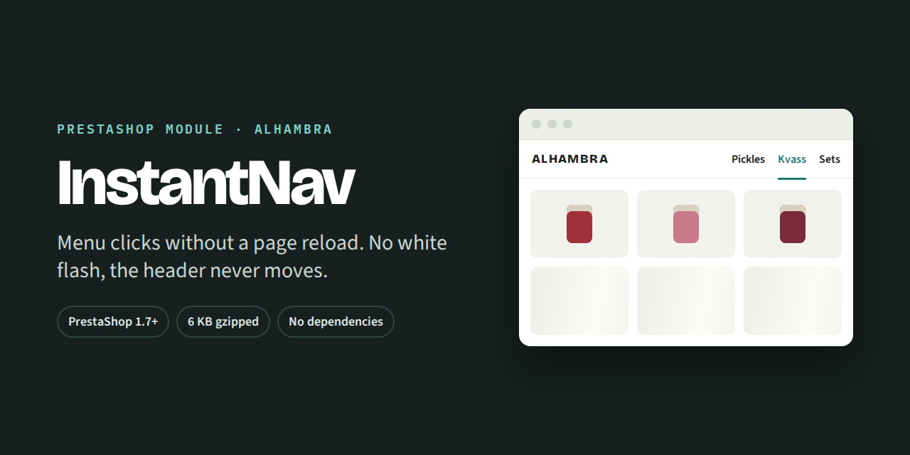
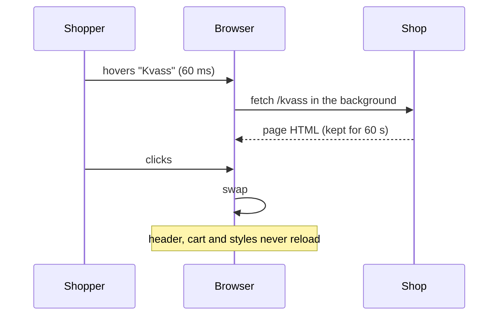
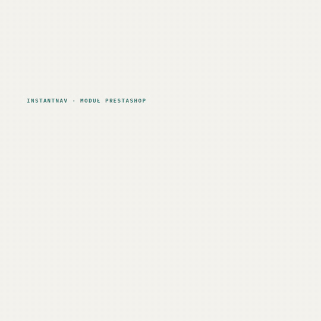
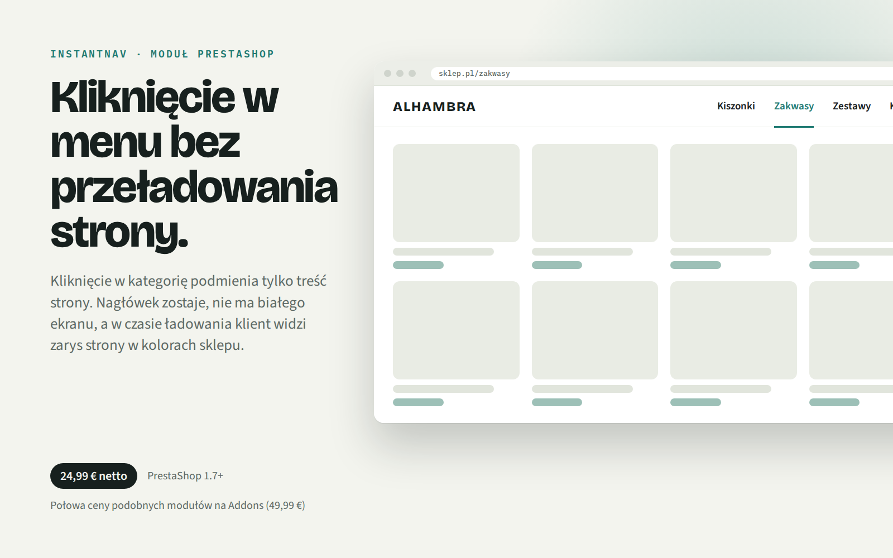
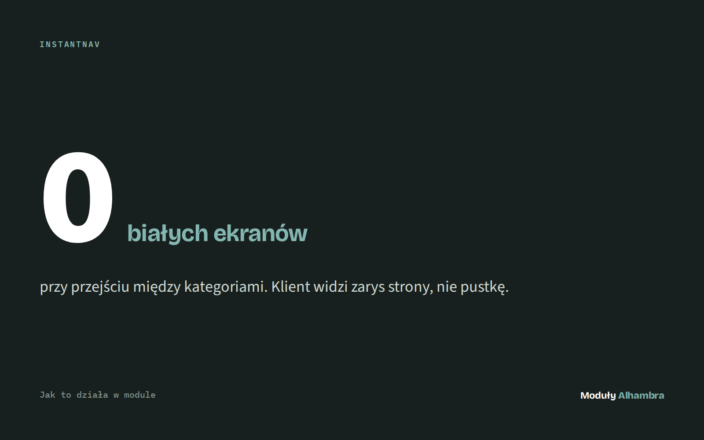
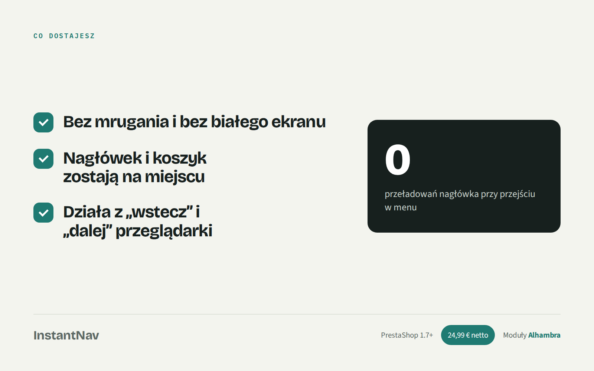

  
  
  
  

# InstantNav

**Menu clicks without a page reload.** Click a category and only the products change. The header stays put, the shop never flashes white, and the page feels like an app.

## Why

A normal menu click in PrestaShop throws the whole page away and builds it again: header, stylesheets, scripts, everything. Only the middle of the page actually changed. InstantNav fetches the next page and swaps in just that middle part.

## What you get

| | Regular PrestaShop | With InstantNav |
|---|---|---|
| White flash between pages | yes | **no** |
| Header and cart redrawn | every click | **never** |
| Next page fetched | after the click | **on hover, 60 ms in** |
| While a slow page loads | blank screen | **outline of the page in your theme's colours** |
| Back / forward buttons | work | **work** |
| Page title, focus, scroll to top | browser does it | **InstantNav does it too** |

- **Fetches ahead on hover.** Rest the mouse on a menu link for 60 ms and the page starts downloading. A fetched page stays usable for 60 seconds.
- **No placeholder when it isn't needed.** The loading outline appears only if the page takes longer than 140 ms. A page fetched on hover arrives before that, so most clicks show no placeholder at all.
- **A placeholder that fits your theme.** It measures your theme on screen and copies its colour, corner radius and proportions. It draws soft blocks where the content will go, never fake thumbnails.
- **Smooth transitions.** Pick none, fade, fade and rise, or fade and settle (default: fade, 260 ms). Where the browser supports View Transitions, the animation runs on the GPU, so long product lists stay smooth. Anyone who asks their system for reduced motion gets no animation.
- **Works with SmartPrefetch.** If [SmartPrefetch](https://github.com/mateusz-stelmasiak/Prestashop-SmartPrefetch) is installed, pages come straight from its cache and the swap is instant. InstantNav works fine without it.

## Safe by default

Every failure leads to the same place: the ordinary page load the browser would have done anyway. Your shop is never worse off than without the module.

- No History API, no `DOMParser`, a failed fetch, a response that isn't a page, a page without the content region, an error mid-swap: **normal navigation**.
- Links to other sites and links that change something (add to cart, delete, log out, anything with a token) are **never fetched or swapped**.
- Only the links you choose are swapped. Everything else is left alone.
- Scripts inside the new content run as they would on a normal page load, and PrestaShop's `updatedProduct` event fires so other modules can refresh.

## How it works

## Settings

All in the module's configuration page, with a status panel that shows what is active.

| Setting | Default | What it does |
|---|---|---|
| Links swapped | menu links | Which links replace the page instead of reloading it |
| Region replaced | `#wrapper` | The part of the page that is swapped; everything outside it is never touched |
| Hover delay | 60 ms | How long the mouse rests on a link before it is fetched |
| Keep a fetched page | 60 s | How long a page fetched ahead stays usable |
| Placeholder delay | 140 ms | Only slower pages show the loading outline |
| Transition | Fade | None, fade, fade and rise, fade and settle |
| Transition length | 260 ms | Around 250 ms reads as smooth |

## See it

<a href="media/instantnav.mp4">Video (mp4, 8 s)</a>

| | | |
|---|---|---|
|  |  |  |

## Po polsku

**Kliknięcie w menu bez przeładowania strony.** Kliknięcie w kategorię podmienia tylko treść strony. Nagłówek zostaje, nie ma białego ekranu, a w czasie ładowania klient widzi zarys strony w kolorach sklepu.

- Bez mrugania i bez białego ekranu
- Nagłówek i koszyk zostają na miejscu
- Działa z „wstecz” i „dalej” przeglądarki
- Strona pobiera się już po najechaniu na link (60 ms)
- Gdy coś pójdzie nie tak, sklep po prostu ładuje stronę jak zwykle

## Get it

**24,99 € net** · PrestaShop 1.7+ · half the price of similar modules on PrestaShop Addons (49,99 €).

This repository is a showcase. The module code is sold separately and is not public.

---

Built by **Alhambra** for our own PrestaShop store, then packaged for yours. See also: [SmartPrefetch](https://github.com/mateusz-stelmasiak/Prestashop-SmartPrefetch).
